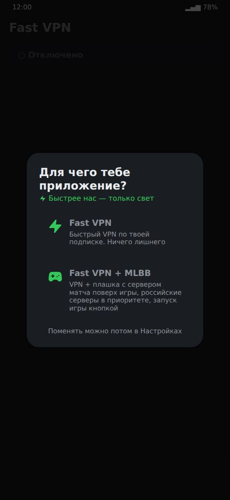
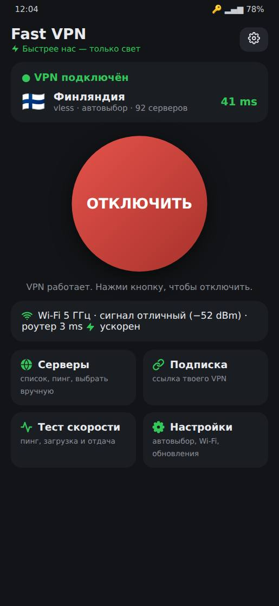
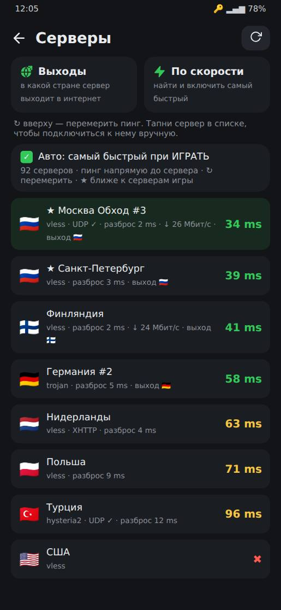
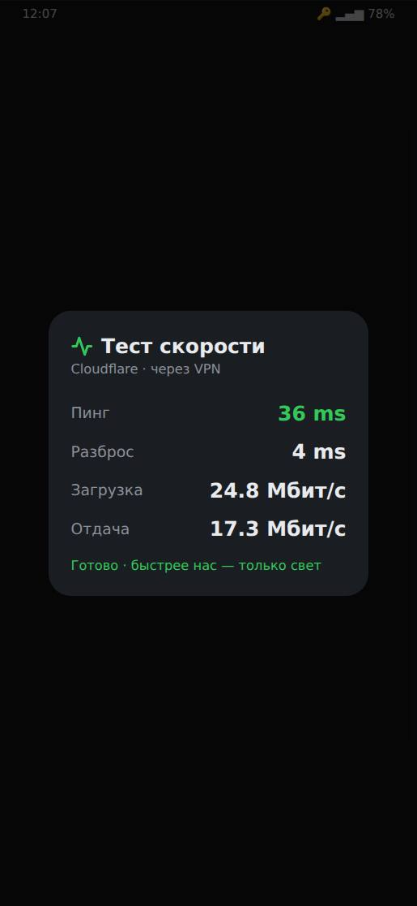
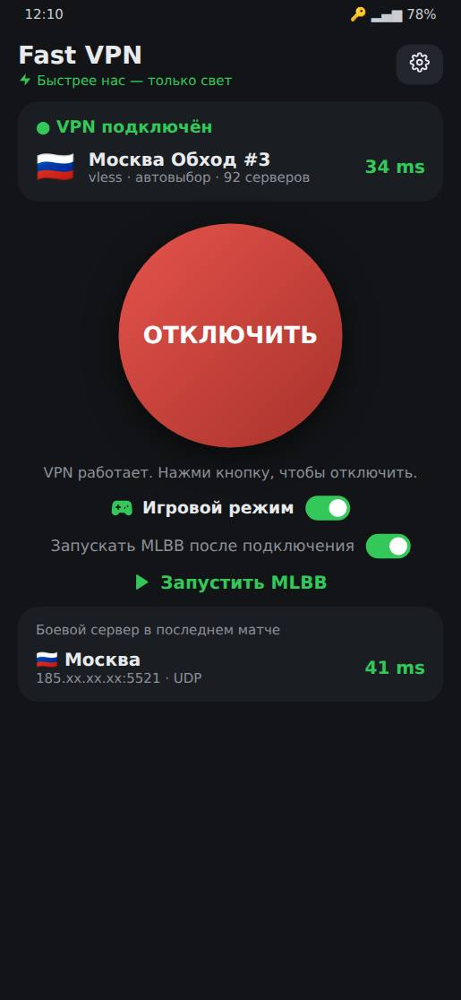
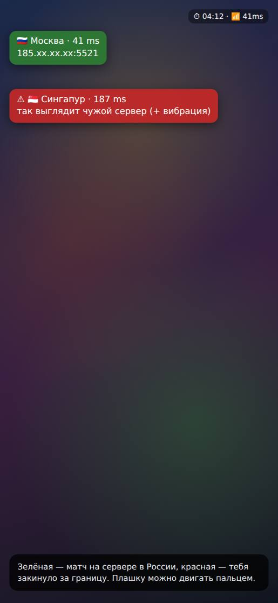

# Гайд по Fast VPN

> ⚡ **Быстрее нас — только свет.**

Полный гайд: как установить, подключиться за пару секунд и пользоваться всеми функциями.
Читай с начала или открывай нужный раздел.

**Красивая версия этого гайда:** https://buninsil.github.io/nextjs-chat/

## Содержание

1. [Что это за приложение](#что-это-за-приложение)
2. [Быстрый старт](#быстрый-старт)
3. [Установка](#установка)
4. [Первый запуск](#первый-запуск)
5. [Главный экран](#главный-экран)
6. [Как работает подключение](#как-работает-подключение)
7. [Экран «Серверы»](#экран-серверы)
8. [Подписка](#подписка)
9. [Настройки](#настройки)
10. [Российские сайты напрямую](#российские-сайты-напрямую)
11. [Приложения через VPN](#приложения-через-vpn)
12. [Плитка в шторке и виджет](#плитка-в-шторке-и-виджет)
13. [Автоподключение](#автоподключение)
14. [Тест скорости](#тест-скорости)
15. [Для игроков MLBB](#для-игроков-mlbb)
16. [Уведомления](#уведомления)
17. [Обновления](#обновления)
18. [Чтобы VPN не отключался сам](#чтобы-vpn-не-отключался-сам)
19. [Если что-то не работает](#если-что-то-не-работает)
20. [Сообщить о проблеме](#сообщить-о-проблеме)
21. [Перенос на новый телефон](#перенос-на-новый-телефон)
22. [Словарик](#словарик)

---

## Что это за приложение

Fast VPN — это VPN-клиент для Android. Своих серверов у него нет: ты вставляешь ссылку **подписки** своего
VPN-сервиса (ту же, что используешь в Karing, Hiddify или v2rayNG), а Fast VPN сам выбирает самый быстрый
рабочий сервер и подключается к нему.

Что умеет кроме обычного VPN:

- подключается за пару секунд и сам держит рабочий сервер;
- пускает банки, Госуслуги и маркетплейсы мимо VPN, поэтому VPN можно вообще не выключать;
- плитка в шторке, виджет, автоподключение на мобильном интернете;
- отдельный режим для игроков Mobile Legends: плашка с сервером матча поверх игры и запуск игры одной кнопкой.

---

## Быстрый старт

1. **Скачай и установи** файл `fast-vpn.apk` со [страницы релизов](https://github.com/BuninSil/nextjs-chat/releases/latest)
   (подробнее — в разделе [«Установка»](#установка)).
2. **Выбери режим** при первом запуске: **Fast VPN** — просто VPN, или **Fast VPN + MLBB** — если играешь в Mobile Legends.
3. **Вставь ссылку подписки:** скопируй её в боте или кабинете своего VPN и нажми **«Вставить ссылку»**.
4. **Нажми большую зелёную кнопку ПОДКЛЮЧИТЬ** и согласись на запрос Android про VPN. Всё.

---

## Установка

Приложения нет в Google Play, оно ставится файлом.

**[⬇ Скачать последнюю версию](https://github.com/BuninSil/nextjs-chat/releases/latest)**

1. Открой ссылку выше на телефоне и скачай файл `fast-vpn.apk` из раздела «Assets».
2. Открой скачанный файл. Если телефон скажет, что установка из этого источника запрещена, нажми **«Настройки»** и разреши.
3. Может появиться окно **«Google Play Защита — Рекомендуется проверка приложения»**. Это нормально: так Google
   встречает любое приложение не из Play Маркета. Нажми **«Установить без проверки»** или **«Проверить»**.
   Не нажимай «Не устанавливать».

> **Чтобы окно Play Защиты не появлялось при каждом обновлении:** Play Маркет → аватарка справа вверху →
> **Play Защита** → шестерёнка → выключи «Проверять приложения с помощью Play Защиты». Учти, что тогда Google
> перестанет проверять и другие приложения не из Маркета.

---

## Первый запуск

Приложение спросит, для чего оно тебе:

- **Fast VPN** — просто быстрый VPN. Всё, что связано с игрой, скрыто.
- **Fast VPN + MLBB** — то же самое, плюс функции для Mobile Legends.

Выбор можно поменять в любой момент: Настройки → «Приложение».

Потом сверху появится зелёная карточка с шагами. Просто иди по ней:

- **Добавь подписку** — нажми «Вставить ссылку». Можно вставить и сами серверы: строки `vless://`, `trojan://` и т. п.
- Только в режиме MLBB: **скачай базу стран** (около 100 МБ, один раз) и **разреши плашку поверх игры**.

Когда всё готово, карточка исчезает сама.

 

---

## Главный экран

- **Шапка.** Название, слоган и шестерёнка — это вход в Настройки.
- **Карточка сервера.** Статус («Отключено», «Подключаюсь…», «VPN подключён»), флаг, название сервера и его пинг.
  Жёлтая строка здесь — предупреждение, что подписка скоро кончится.
- **Большая кнопка.** Зелёная **ПОДКЛЮЧИТЬ** включает VPN, красная **ОТКЛЮЧИТЬ** выключает. Под кнопкой
  написано, что она сейчас сделает. Пока идёт подключение и в момент подключения играет анимация — её выбирают в Настройках → «Оформление»: **Гиперпрыжок** (звёзды на весь экран срываются в лучи, при подключении — вспышка), **Спидометр** (шкала вокруг кнопки, потом показывает реальную скорость) или **Радар** (луч ищет серверы, лучший берётся в прицел). Подключилось — телефон коротко вибрирует.
- **Wi-Fi.** Диапазон (2.4 или 5 ГГц), сигнал и пинг до роутера. Если Wi-Fi плохой, там появится совет.
- **Плитки.** «Серверы», «Подписка», «Тест скорости», «Настройки». В режиме MLBB есть ещё «Лог».

 

---

## Как работает подключение

Нажал **ПОДКЛЮЧИТЬ** — приложение сразу подключается к последнему удачному серверу и за секунду проверяет,
что он отвечает. Обычно на всё уходит 2–3 секунды.

Полный подбор (пинг до всех серверов, потом скорость лучших) запускается, только когда он нужен:

- сервер не отвечает;
- ты сменил сеть (Wi-Fi ↔ мобильный интернет);
- с прошлого подбора прошло больше 6 часов;
- обновилась подписка.

Подбор идёт, когда VPN уже работает: интернетом можно пользоваться сразу, а прогресс видно в карточке сервера.
**ОТКЛЮЧИТЬ** нажимается в любой момент.

Пока VPN включён, приложение раз в полминуты проверяет сервер. Если он перестал отвечать, приложение само тихо
переключится на рабочий. В режиме для игры так не делается: там сервер не меняется никогда, иначе скакал бы пинг.

---

## Экран «Серверы»

Здесь все серверы из подписки. У каждого: флаг, название, протокол, пинг (зелёный — хорошо, жёлтый — так себе,
красный — плохо), разброс пинга, а после проверок ещё скорость `↓ N Мбит/с` и страна выхода.

- **Тап по серверу** — подключиться к нему вручную. Автовыбор при этом выключается.
- **Долгое нажатие** — меню «В избранное» или «Скрыть». Избранные всегда сверху с жёлтой звёздочкой, и
  автовыбор берёт их первыми. Скрытые автовыбор не трогает; вернуть их можно кнопкой «Показать скрытые».
- **Галочка «Автовыбор сервера»** — сервер подбирается сам. Включи её обратно, если выбирал сервер вручную.
- **Круглая стрелка вверху** — перемерить пинг до всех серверов.
- **«Выходы»** — узнать, в какой стране каждый сервер на самом деле выходит в интернет. Это важно для серверов
  «Обход» и «Мост»: подключаешься к ним в России, а сайты видят тебя, например, из Нидерландов.
- **«По скорости»** — замерить скорость через лучшие серверы и включить самый быстрый.

«Выходы» и «По скорости» работают через VPN. Если он выключен, приложение само включит его на время проверки
и потом выключит. Идёт окно с прогрессом и кнопкой «Стоп», в конце показывается итог.

 

---

## Подписка

Плитка **«Подписка»** на главном экране. Вставь ссылку (кнопка «Вставить из буфера») и нажми
**«Сохранить и обновить»**. Внизу окна видно, сколько серверов, сколько трафика использовано и до какого
числа подписка.

- **Сама обновляется раз в сутки** — ничего нажимать не нужно.
- **Предупреждает:** за 3 дня до конца срока или когда трафика почти не осталось, придёт уведомление, а на
  главном экране появится жёлтая строка.
- **Если ссылка не открывается напрямую** (на мобильном интернете такое бывает), приложение скачает подписку
  через свой VPN на уже сохранённых серверах.

> **«Сервер подписки пускает только с российских адресов».** Некоторые VPN-сервисы отдают подписку только на
> российский IP. Если в Fast VPN уже есть серверы, он сам скачает подписку через сервер с выходом в России.
> Если это первый раз и серверов ещё нет, выключи другой VPN или переключи его на российский сервер, либо
> подключись к обычному Wi-Fi.

---

## Настройки

Шестерёнка на главном экране. Всё сохраняется сразу, кнопки «Сохранить» нет. Что касается VPN, применится после
переподключения: **ОТКЛЮЧИТЬ** → **ПОДКЛЮЧИТЬ**.

| Пункт | Что делает |
| --- | --- |
| **Приложение** | Fast VPN или Fast VPN + MLBB. |
| **Оформление** | Тема: Тёмная (по умолчанию), Светлая, Неон, AMOLED (чёрная — экономит батарею). Анимация подключения: Гиперпрыжок, Спидометр или Радар — с живым превью. |
| **Автовыбор сервера** | Сам выбирает самый быстрый рабочий сервер при подключении. |
| **Российские сайты напрямую** | Банки, Госуслуги, маркетплейсы, Яндекс, VK — мимо VPN. Включено по умолчанию. [Подробнее](#российские-сайты-напрямую). |
| **Блокировать рекламу и трекеры** | Рекламные и следящие сайты не загружаются. |
| **Приложения через VPN** | Все, только выбранные или все, кроме выбранных. [Подробнее](#приложения-через-vpn). |
| **Через VPN только игра** *(MLBB)* | Через VPN идёт только Mobile Legends, всё остальное — напрямую. |
| **Матч напрямую** *(MLBB)* | Трафик самого матча идёт мимо VPN — минимальный пинг. Работает, только если оператор пускает к игровым серверам без VPN. |
| **Режим** *(MLBB)* | Встроенный VPN (рекомендую), Без VPN (только плашка с сервером) или Внешний VPN-клиент. |
| **Автоподключение** | Включать VPN на мобильном интернете и выключать на Wi-Fi. [Подробнее](#автоподключение). |
| **Ускорение Wi-Fi** | Wi-Fi не засыпает между пакетами — меньше скачков пинга. Работает и без VPN. |
| **Предупреждение** *(MLBB)* | Вибрация, если матч попал на сервер не из твоих стран (по умолчанию RU). |
| **База стран** | Скачать или загрузить файлом базу, по которой определяется страна и город серверов. |
| **Обновления** | Обновлять автоматически и кнопка «Проверить обновления». |
| **Перенос на другой телефон** | Сохранить все настройки в файл или загрузить из файла — [подробнее](#перенос-на-новый-телефон). |
| **Помощь** | «Сообщить о проблеме» — [подробнее](#сообщить-о-проблеме). |

---

## Российские сайты напрямую

Обычно с VPN банк или Госуслуги не открываются, и VPN приходится выключать. Fast VPN решает это сам: сайты в
зонах `.ru`, `.рф`, `.su`, банки, Госуслуги, Озон, Wildberries, Авито, Яндекс, VK и другие российские сервисы
идут **мимо VPN**, а всё остальное — через него.

Включено по умолчанию, выключается в Настройках. Определение идёт только по адресам сайтов. Игровые серверы и
всё, что подключается напрямую по IP, идёт через VPN как раньше.

---

## Приложения через VPN

Настройки → «Приложения через VPN». Три варианта:

- **Все приложения** — через VPN идёт весь телефон (по умолчанию).
- **Только выбранные** — через VPN только отмеченные, например YouTube и Telegram.
- **Все, кроме выбранных** — отмеченные идут напрямую, например банковское приложение.

Ниже — список приложений с поиском, отмечай галочками. Применится после переподключения VPN.

---

## Плитка в шторке и виджет

### Плитка «Fast VPN»

1. Опусти шторку уведомлений до конца.
2. Нажми карандаш («Изменить»).
3. Найди плитку **Fast VPN** с молнией и перетащи её к остальным.

Нажатие на плитку включает и выключает VPN, а под ней видно сервер.

### Виджет на рабочий стол

Долгое нажатие на пустом месте рабочего стола → «Виджеты» → **Fast VPN**. На виджете статус, сервер с пингом и
кнопка «Подключить» / «Отключить».

> Если VPN ещё ни разу не разрешали или подписки нет, плитка и виджет откроют приложение.

---

## Автоподключение

Настройки → «Автоподключение».

- **Включать на мобильном интернете** — ушёл с Wi-Fi, и VPN включился сам. На некоторых телефонах Android не
  даёт приложению включить VPN в фоне. Тогда придёт уведомление «Ты на мобильном интернете — нажми, чтобы включить».
- **Выключать на Wi-Fi** — если VPN включился сам, на Wi-Fi он выключится.

Если выключил VPN руками, сам он не включится, пока ты не сменишь сеть.

---

## Тест скорости

Плитка **«Тест скорости»**. Меряет пинг, разброс, скорость загрузки и отдачи через серверы Cloudflare. Если VPN
включён — через него, если нет — напрямую.

Удобно сравнить: сделай тест без VPN, потом с VPN. Если без VPN тоже медленно, тормозит сам интернет или Wi-Fi,
а не VPN.

 

---

## Для игроков MLBB

Включается выбором **Fast VPN + MLBB**. На главном экране появляются:

- **Игровой режим** — переключатель. Включён: российские серверы в приоритете, сервер выбирается один раз до
  запуска игры и дальше не меняется, работает плашка поверх игры.
- **Запускать MLBB после подключения** — тогда большая кнопка называется **ИГРАТЬ**: подключает VPN и сама
  открывает игру.
- **Боевой сервер в последнем матче** — где проходил матч и какой был пинг.
- **Лог** — куда подключалась игра, с выгрузкой в CSV.

Сервер для игры выбирается с **выходом в России**. Иначе игра решит, что ты за границей, и закинет матч,
например, в Лондон.

 

### Плашка поверх игры

Появляется, когда начинается матч. Показывает флаг, город и пинг сервера матча.

- **Зелёная** — матч на сервере в России (или в твоих странах из настроек).
- **Красная** — тебя закинуло на зарубежный сервер. Если включено «Предупреждение», телефон ещё и завибрирует.

Плашку можно двигать пальцем в любое место экрана.

 

---

## Уведомления

- **Уведомление VPN** висит, пока VPN работает. В нём скорость прямо сейчас (↓ загрузка, ↑ отдача) и сколько
  трафика ушло за сессию и за сегодня. Кнопка «Стоп» выключает VPN.
- **Подписка** — скоро закончится срок или трафик.
- **Обновление** — вышла новая версия, она уже скачана, нажми, чтобы установить.
- **Автоподключение** — нажми, чтобы включить VPN на мобильном интернете.

Разреши приложению уведомления, когда оно спросит, иначе ничего этого не увидишь.

---

## Обновления

Раз в несколько часов приложение само проверяет, есть ли новая версия, и скачивает её. Потом приходит
уведомление «Обновление Fast VPN скачано — нажми, чтобы установить». Нажимаешь, и открывается обычный
установщик Android.

- Проверить вручную: Настройки → «Проверить обновления».
- Если пропустил несколько версий, в окне обновления будут изменения каждой по порядку.
- После установки откроется окно «Обновлено до …» с тем, что нового.
- Выключить: Настройки → «Обновлять автоматически».

---

## Чтобы VPN не отключался сам

Xiaomi, Redmi, POCO, Huawei, Honor, Samsung и другие экономят батарею и могут закрывать приложения в фоне
вместе с VPN. Один раз настрой так:

1. Настройки телефона → Приложения → **Fast VPN**.
2. **Контроль активности / Батарея** → «Нет ограничений».
3. **Автозапуск** → включить (есть на Xiaomi и Huawei).
4. Можно ещё закрепить приложение в списке недавних (замочек), чтобы его не выгружало.

---

## Если что-то не работает

<b>VPN не подключается</b>

Появится окно с причиной. Чаще всего помогает: проверить интернет без VPN, обновить подписку, нажать круглую
стрелку в «Серверах» и включить «Автовыбор сервера».

Если в ошибке написано, что Android не дал поднять VPN, значит, у другого VPN-приложения включён «Постоянный
VPN». Выключи его: Настройки телефона → Сеть и интернет → VPN → шестерёнка у того приложения.

<b>Подключился, но интернета нет</b>

Значит, сервер подключается, но трафик через него не идёт. Включи «Автовыбор сервера» и переподключись:
приложение найдёт рабочий. Или выбери другой сервер вручную в «Серверах».

<b>Банк или Госуслуги не открываются с VPN</b>

Проверь, что в Настройках включено «Российские сайты напрямую», и переподключи VPN. Если у банка не российский
адрес сайта, добавь приложение банка в «Приложения через VPN» → «Все, кроме выбранных».

<b>Подписка не обновляется</b>

- Ошибка про устройства (device, HWID, limit): удали старое устройство в боте или кабинете своего VPN или
  увеличь лимит.
- «Пускает только с российских адресов» — смотри раздел [«Подписка»](#подписка).
- Можно вставить в «Подписку» не ссылку, а сами серверы (строки `vless://`, `trojan://`…).

<b>Медленно работает</b>

Сделай [тест скорости](#тест-скорости) без VPN и с VPN. Если без VPN тоже медленно — дело в интернете или Wi-Fi:
подойди к роутеру, переключись на 5 ГГц. Если медленно только с VPN — в «Серверах» нажми «По скорости».

<b>Большой пинг в игре</b>

Убедись, что включён «Игровой режим» и у выбранного сервера выход в России (кнопка «Выходы» в «Серверах»).
Попробуй «Матч напрямую», если оператор пускает. На Wi-Fi включи «Ускорение Wi-Fi».

<b>VPN сам отключается</b>

Это прошивка закрывает приложение в фоне. Сделай настройки из раздела
[«Чтобы VPN не отключался сам»](#чтобы-vpn-не-отключался-сам). Ещё VPN отключается, если включить другое
VPN-приложение: Android держит только один VPN.

<b>Автоподключение не включает VPN</b>

На части телефонов Android не даёт включить VPN в фоне. Тогда приходит уведомление с кнопкой — нажми её.
Проверь, что уведомления приложению разрешены.

<b>«Выходы» показывают у всех одну страну</b>

Это было в старых версиях. Обнови приложение и нажми «Выходы» ещё раз.

<b>Приложение вылетело</b>

При следующем запуске появится окно «Прошлый запуск упал» с текстом ошибки. Нажми «Скопировать» и отправь
разработчику, или воспользуйся [«Сообщить о проблеме»](#сообщить-о-проблеме).

---

## Сообщить о проблеме

Настройки → «Помощь» → **«Сообщить о проблеме»**. Приложение соберёт отчёт файлом: версия, телефон, настройки,
замеры серверов, последнее падение и полный журнал — каждое нажатие, подключение и ошибка с точным временем. Нажми «Отправить» и выбери, куда отправить разработчику:
Telegram, почта, что угодно. Или «Скопировать» и вставь в сообщение.

В отчёте **нет** ссылки подписки, адресов серверов и паролей. В журнале VPN могут встречаться адреса сайтов,
которые открывались.

---

## Перенос на новый телефон

Купил новый телефон — не надо заново вставлять подписку и всё настраивать.

1. На **старом** телефоне: Настройки → «Перенос на другой телефон» → **«В файл»** (сохранить, например, в
   Загрузки) или **«Отправить»** — и скинь файл себе: Telegram «Избранное», почта, облако.
2. На **новом** телефоне поставь Fast VPN, открой Настройки → **«Загрузить из файла»** и выбери этот файл.
   Приложение покажет, когда он сохранён и сколько в нём серверов, и спросит подтверждение.

Переносится всё: подписка со списком серверов, выбранный сервер, режим, тема, избранные и скрытые серверы,
страны выхода, российские сайты напрямую, блок рекламы, выбор приложений, автоподключение. Не переносится то,
что относится к самому телефону: замеры пинга (сделаются заново), статистика трафика, идентификатор устройства.

> В файле лежит ссылка на твою подписку. **Не отправляй его другим людям** — по ней можно пользоваться твоим VPN.

---

## Словарик

| Слово | Что значит |
| --- | --- |
| **VPN** | Защищённый «туннель»: телефон ходит в интернет через другой компьютер — сервер. Сайты видят адрес сервера, а не твой. |
| **Подписка** | Ссылка от твоего VPN-сервиса, в которой лежит список его серверов. Её выдают в боте или личном кабинете. |
| **Сервер** | Компьютер VPN-сервиса, через который идёт трафик. У разных серверов разные страны, скорость и пинг. |
| **Пинг** | За сколько миллисекунд (ms) сигнал доходит до сервера и обратно. Меньше — лучше. До 60 ms — отлично, 60–100 — нормально, больше 100 — заметно в играх. |
| **Разброс** | Насколько пинг скачет. Чем меньше, тем стабильнее. |
| **Выход** | Страна, из которой сервер на самом деле выходит в интернет. Подключиться можно к серверу в России, а выйти через Нидерланды. |
| **Мбит/с** | Скорость интернета. Для видео в хорошем качестве хватает 10–20 Мбит/с, для игр важнее пинг. |

---

Fast VPN · BuninSil · Картинки экранов примерные, в приложении всё может выглядеть чуть иначе.
